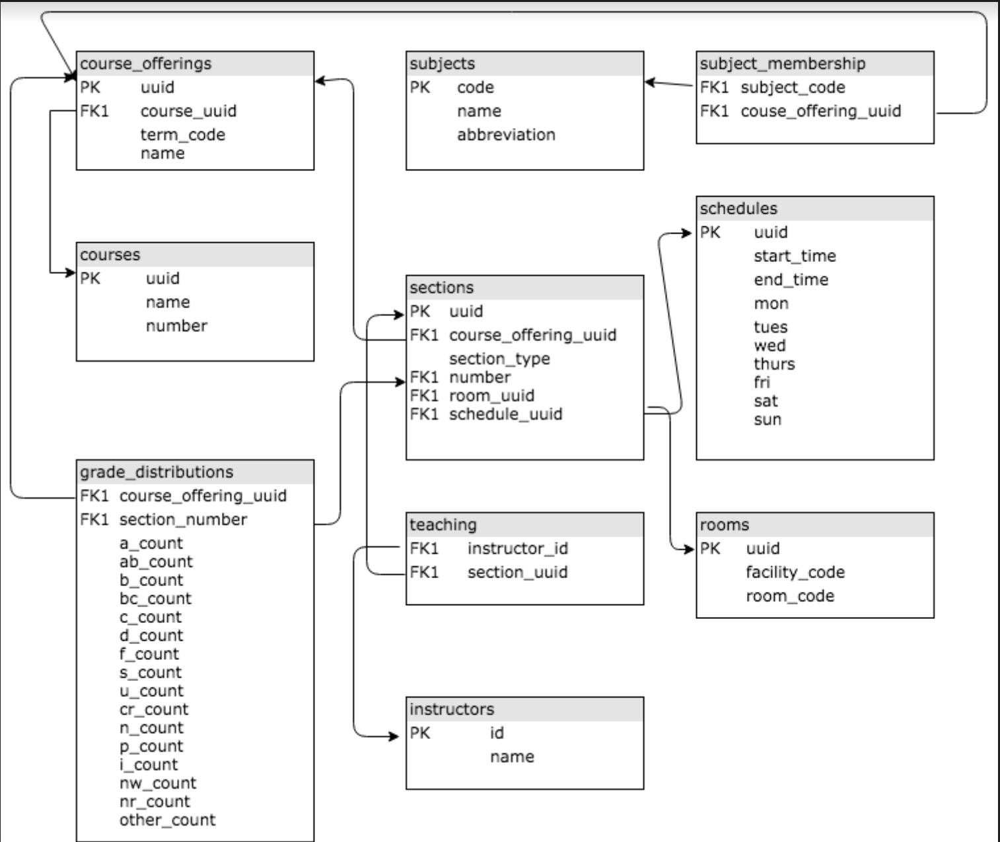

# Building A Better Course Schedule

Team Member 1: Alexander Bailey
Team Member 2: Kayli Leung
[Presentation](presentation.pdf)

## Business Understanding

A university wants to set its students up for success. One way in which that can be done is to create a schedule that maximizes the the percentage of A's in a specific class. Using [Kaggle's UW Madison Grade's Database](https://www.kaggle.com/Madgrades/uw-madison-courses), we will explore different factors that make up a schedule with this goal in mind. Without an indicator we cannot distinguish between Undergraduate and Graduate classes, therefore the recommendations will apply to the entirety of the University's courses.

## Data Understanding

Below is a database schema of the UW Madison Grade Database. It does not show if relationships are one-to-many, one-to-one, etc, but it does show connections between primary and foreign keys.

## Data Preparation

Before any of the question notebooks can be run, create a local database using this [notebook](setup_database.ipynb).

We specifically want to look at Lecture and Seminar sections. This is because Independent/Field Studies are often self-scheduled and Lab/Discussion sections grades are usually a contributing grade to the lecture grade rather than the grade a student sees on their transcript.

## Questions Explored

### [Time of Day](am_pm_and_grades.ipynb)

1. Does the time of day in which a class starts (AM or PM) have an effect on the percentage of A's given to a class? 

We ran a two-tailed, two-sample t-test and found there is **no significant difference** in percentage of A's in AM or PM classes. 

### [Length of Class](length_and_grades.ipynb)
2. Does the length of the class have an effect on the percentage of A's given to a class? 

We ran several t-tests and found there is not a statistically significant difference between short (1 hour) and medium classes (1-2 hours), but **long classes (2-3 hours) are statistically better** than both medium and short classes. 

### [Days per Week](grades_by_days_per_week.ipynb)
3. Does the number of days a class meets have an effect on the percentage of A's given to a class? 

We ran several t-tests and found that less classes a week, specifically having **one class a week has significantly greater** mean percentage of A's.

### [Math and Time of Day](math_time_and_grades.ipynb)
4. Once we discovered that time of day does not appear to have an effect (see question 1), we wanted to see if a math classes were impacted by AM or PM classes? 

We ran a two-tailed, two-sample t-test and found there is **no significant difference** in percentage of A's in AM or PM classes for mathematics classes. 
     
## Evaluation

We would suggest creating a schedule in which each class meets less times a week, but for a longer period of time. If space allows the ideal would be one, three hour lecture a week. It does not matter whether that class is in the AM or PM.

## Future Exploration
We would like to further evaluate different subject by time of day as we have only completed Math so far. We would also like to separate our data into Undergraduate and Graduate courses. We would also like to graph multiple trials to show how the significance changes with different samples.

